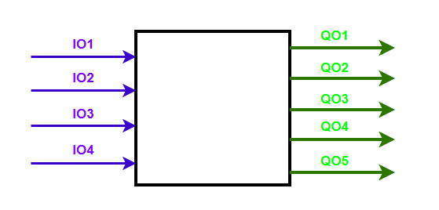
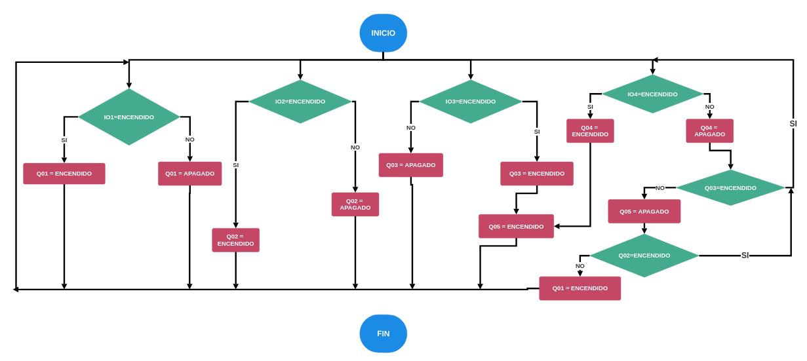
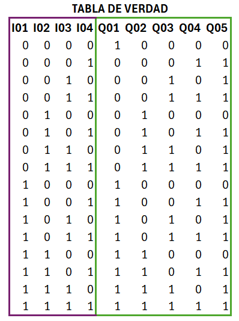
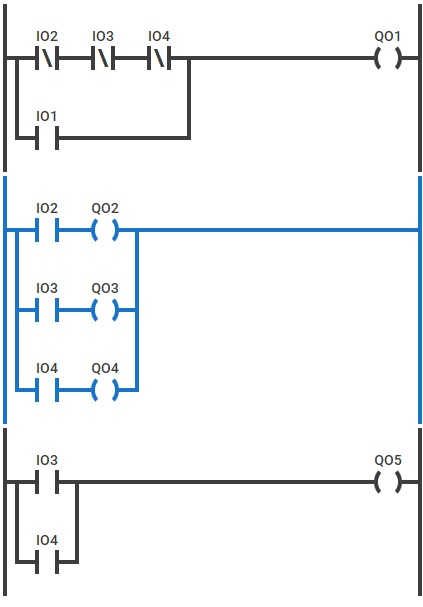
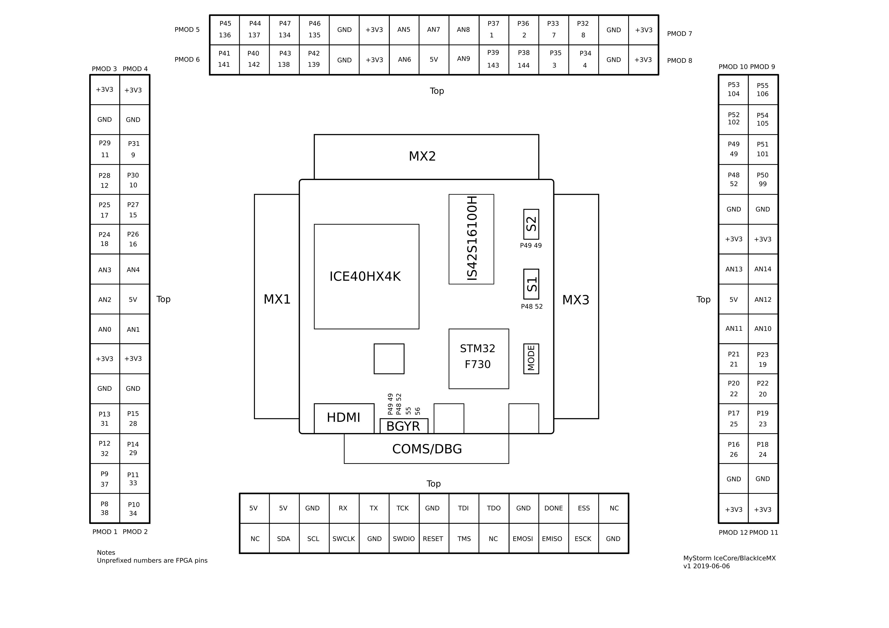

# Proyecto: Mi Primer Diseño Digital 🔧⚡
Este repositorio contiene el desarrollo de un sistema de energía renovable que permite conmutar entre la red eléctrica comercial y un banco de baterías basado en energía solar. Se sigue un flujo de diseño estructurado para la implementación del sistema en FPGA.

## 📌 Objetivos
- Diseñar un sistema que conmute entre dos fuentes de energía según las condiciones del entorno.
- Implementar el diseño en diferentes dominios: comportamental, estructural y físico.
- Sintetizar el diseño en una FPGA y evaluar su funcionamiento.


## 🚀 Desarrollo del Proyecto
### 🔹 1. Dominio Comportamental
- 📌 Se define la funcionalidad en un **diagrama de caja negra**.



#### I01 Boton de paro de emergencia.
#### I02 Sensor de disponibilidad de Red electrica.
#### I03 Sensor de carga en Baterias.
#### I04 Sensor de Luz solar.

#### Q01 Indicador Casa desenergizada.
#### Q02 Indicador red electrica disponible .
#### Q03 Indicador carga baterias.
#### Q04 Indicador radiacion solar .
#### Q05 Conmutador entre fuentes de energia.


- 📌 Se elabora un **diagrama de flujo** del sistema.



Este diagrama de flujo representa un proceso de control continuo basado en condiciones lógicas, donde cuatro entradas digitales (IO1, IO2, IO3, IO4) determinan el estado de cinco salidas (Q01 - Q05). Cada entrada activa o desactiva salidas específicas, y algunas salidas dependen del estado de otras, creando una lógica secuencial y condicional. Como el flujo regresa constantemente a evaluar las condiciones sin alcanzar un estado de finalización, se trata de un proceso cíclico o infinito.


- 📌 Se define la **tabla de verdad** basada en las condiciones de operación.



### 🔹 2. Dominio Físico Inicial
- 📌 Diseño del **circuito eléctrico** en **lenguaje Ladder**.



### 🔹 3. Simulación en Ladder  
📌 **Validación del comportamiento en PLCSimulator**  

---

#### 🏠 3.1. Sin fuentes de energía disponibles  
Ningún sensor detecta una fuente de energía activa, por lo que **Q01** indica que la casa no está energizada.  

  

---

#### ☀️ 3.2. Energización con luz solar directa  
La casa recibe energía únicamente de la luz solar. **Q01** permanecerá inactivo hasta que alguna fuente de energía se reactive o se presione el botón de emergencia (**I01**).  

  

---

#### 🔋 3.3. Energización con baterías cargadas por luz solar  
**Q05** (el conmutador) se activa cuando la casa es alimentada por luz solar directa o por baterías cargadas con energía solar. Este indicador permite visualizar cuándo se están utilizando los paneles solares o las baterías como fuente de energía.  

  

---

#### 🔋☀️ 3.4. Disponibilidad de luz solar y baterías cargadas  
Se detecta la presencia simultánea de luz solar y baterías cargadas, lo que permite alimentar la casa con estas fuentes de energía.  

  

---

#### ⚡ 3.5. Energización únicamente con la red eléctrica  
La casa recibe energía exclusivamente de la red eléctrica. En este caso, **Q05** cambia de estado, permitiendo el paso de la energía de la red para alimentar la casa.  

  

---

#### ⚡☀️ 3.6. Disponibilidad de red eléctrica y luz solar  
Aunque la red eléctrica está disponible, el sistema prioriza el uso de energía solar para alimentar la casa, optimizando el consumo energético.  

  

---

#### 🔋⚡ 3.7. Disponibilidad de energía solar almacenada en baterías y red eléctrica  
Dado que las baterías están cargadas con energía solar, el sistema continúa priorizando su uso antes de recurrir a la red eléctrica.  

  

---

#### ☀️🔋⚡ 3.8. Disponibilidad simultánea de luz solar, baterías cargadas y red eléctrica  
A pesar de contar con todas las fuentes de energía disponibles, el sistema sigue priorizando la energía solar para alimentar la casa, asegurando un mayor ahorro energético.  

  

---

#### ❌ 3.9. Disponibilidad de todas las fuentes de energía con I01 activado  
Aunque todas las fuentes de energía están disponibles (**Q02**, **Q03** y **Q04** activas), la casa no se energiza debido a que la entrada **I01** (energizador de la casa) está activada. No obstante, los indicadores y el conmutador siguen operando de acuerdo con la lógica establecida en los casos anteriores.  

  

---

### Puntos importantes
✅ Cada imagen representa una simulación en lenguaje Ladder validando la lógica del sistema.  
✅ El sistema prioriza siempre el uso de energía solar y baterías antes de recurrir a la red eléctrica.  
✅ **I01** actúa como un botón de emergencia, desactivando la energización de la casa incluso si hay fuentes de energía disponibles.  


### 🔹 4. Dominio Estructural  
📌 **Conversión a red de compuertas lógicas**  

Siguiendo las instrucciones del documento proporcionado por el docente ([Notas del laboratorio](https://github.com/johnnycubides/digital-electronic-1-101/blob/main/labs/lab2/notas_annotated.pdf)), realizamos la conversión del dominio físico al estructural. Este proceso nos permitió modelar el sistema en el software **Digital**, utilizando compuertas lógicas para representar su funcionamiento. 

El archivo de con el diagrama se puede observar en ([Archivo Digital](Simulaciones/SimulacionDigital.dig))

---

#### 🔌 4.1. Simulación en **Digital**  
El siguiente diagrama muestra la implementación del sistema en el software **Digital**, verificando su correcto comportamiento en el dominio estructural.  
  

---

#### 🧩 4.2. Mapas de Karnaugh  
Para simplificar las expresiones lógicas y optimizar el diseño del sistema, realizamos la minimización mediante **Mapas de Karnaugh**:  

1️⃣ **Mapa de Karnaugh para Q01**  
  

2️⃣ **Mapa de Karnaugh para Q02**  
  

3️⃣ **Mapa de Karnaugh para Q03**  
  

4️⃣ **Mapa de Karnaugh para Q04**  
  

5️⃣ **Mapa de Karnaugh para Q05**  
  

---

#### 📊 4.3. Tabla de verdad verificada  
La siguiente tabla de verdad representa el comportamiento esperado del sistema con base en la lógica estructural.  
Se verificó la **tabla de verdad**, garantizando que la implementación es funcional y precisa.  
  

---

#### 🔀 4.4. Representación con compuertas universales NAND

Como alternativa de implementación, se realizó la conversión del sistema utilizando **compuertas NAND**, las cuales permiten diseñar cualquier circuito lógico minimizando el número de componentes.  

  

---


## 🔹 5. Descripción en Verilog (HDL)  
📌 **Conversión del diseño a código Verilog (`top.v`)**  

Para la transición del dominio estructural simulado en **Digital** a la síntesis en FPGA, seguimos las indicaciones del siguiente video:  
▶️ [Conversión a Verilog](https://www.youtube.com/watch?v=2GnsQ3oH4YA)  

Tras la exportación, el archivo `top.v` quedó con el siguiente código:  

```verilog
/*
 * Generated by Digital. Don't modify this file!
 * Any changes will be lost if this file is regenerated.
 */

module top (
  input IO1,
  input IO2,
  input IO3,
  input IO4,
  output QO2,
  output QO3,
  output QO4,
  output QO1,
  output QO5
);
  assign QO1 = (IO1 | (~ IO4 & ~ (IO2 | IO3)));
  assign QO5 = (IO3 | IO4);
  assign QO2 = IO2;
  assign QO3 = IO3;
  assign QO4 = IO4;
endmodule 
```
La siguiente imagen muestra el circuito lógico que será implementado en la FPGA:
  

Se configuro el archivo de restricciones fisicas (`top.pcf`) en el cual se especifican los pines para las entradas y las salidas, este es el codigo utilizado:

```
#CONFIGURACION DE PINES
set_io IO1 9 # BOTON
set_io IO2 10 # RED
set_io IO3 11 # BATERIAS
set_io IO4 12 # Sensor Luz

#SALIDAS
set_io QO1 31 # ROJO
set_io QO2 32 # VERDE
set_io QO3 37 # BLANCO
set_io QO4 38 # AZUl
set_io QO5 34 # RELE 
```


## 🔹 6. Síntesis en FPGA  
📌 **Implementación en FPGA, configuración de pines y pruebas con sensores y actuadores**  

Para la síntesis del diseño en la **FPGA BlackIce MX**, seguimos el procedimiento detallado en el video previamente referenciado. Se realizó la configuración de pines y la conexión del circuito en una protoboard, asegurando la correcta interacción entre los sensores y actuadores.  

📌 **Asignación de pines y conexiones**  

Para la conexión del circuito, seguimos la distribución de pines mostrada en la siguiente imagen:  
🖼️   

📌 **Componentes utilizados**  
✔️ **FPGA BlackIce MX**  
✔️ **Protoboard**  
✔️ **Interruptores**  
✔️ **Fotoresistencias**  
✔️ **Modulo Rele**  
✔️ **Jumpers y resistencias**  
✔️ **LEDs para la visualización de señales**  

📌 **Pruebas y validación**  

Una vez realizada la conexión del hardware y la carga del código en la FPGA, verificamos el correcto funcionamiento del sistema mediante pruebas con los sensores y actuadores.  

El siguiente video muestra la demostración del sistema en funcionamiento:  
▶️ *(video de YouTube)*  


## 🛠️ Herramientas Utilizadas
- **PLCSimulator** → Para simulación en Ladder.
- **Digital** → Para diseño y simulación de compuertas lógicas.
- **Verilog (Lite-xl)** → Para simulación HDL.
- **BlackIce MX FPGA** → Para la implementación final en hardware.

## 👨‍💻 Autor
Desarrollado por Tomás Cuartas. Este proyecto fue realizado como parte del laboratorio de **Digital 1**.

---
📌 *Para más detalles, consulta cada directorio en este repositorio.*


